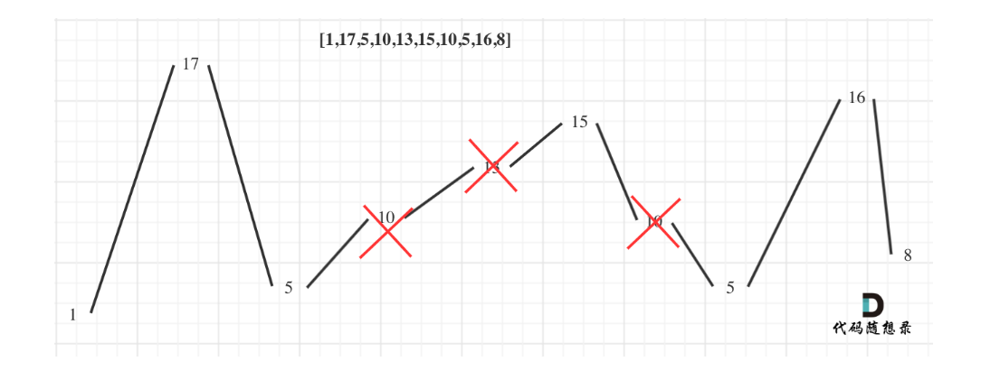

# 贪心总结篇

贪心类问题其实没有固定的解法，主要还是基于观察和推理进行总结。

建议是反复观察贪心题目，掌握局部最优解构建全局最优解的做法。

以下是大致的解题思路分类总结，比如：

1. 分发饼干、柠檬水找零是贪心基础题目，用于体会局部最优解推出整体最优解的贪心求解过程。

2. 划分字母区间、单调递增的数字、摆动序列是属于可以用很巧妙的方法求解的题目。划分字母区间是记录字母最远出现位置，然后等找到当前字母为最远字母的时候向前比遍历判断本次的子串是不是都是最远字母子串。摆动序列实际上就是要找到最多的波峰和波谷，局部最优解就可以退出整体最优解，删除路径上不满足条件的点即可。单点递增的数字也是巧妙地运用了贪心，要使得当前的两位数最小，则可以把前一位减1，后续所有位变成9，并且遍历是从后往前遍历，这样保证了局部一直是最优解。

   

3. 合并区间、扎气球、无重叠区间、根据身高重建队列、K次取反后的最大化数组，这几题是比较经典的贪心题目，主要是进行排序（注意按照哪个字段进行排序，之后的判断会有些许不同）

4. 加油站则是结合了模拟的过程，要求熟练使用while循环，对题目过程进行行驶和加油的模拟。同时可以利用count进行优化，无需遍历完全部数据

5. 监控二叉树是贪心题目的综合性难题，运用贪心的思想，利用三个状态来记录当前节点的状态，分别是0-未覆盖，1-已覆盖，2-有相机，然后判断当前节点的左右子节点状态进行处理当前节点，并记录count。

感觉还是得多看多练，贪心并不像递归、回溯那样有固定的模板，大道至简，能出最简单的题目，也能出最难的题目，重点是能不能看破题目使用到贪心，并掌握特定的贪心求解方法。