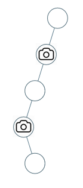

# 968.监控二叉树

## 题目描述：

给定一个二叉树，我们在树的节点上安装摄像头。

节点上的每个摄影头都可以监视**其父对象、自身及其直接子对象。**

计算监控树的所有节点所需的最小摄像头数量。

 

**示例 1：**


```
输入：[0,0,null,0,0]
输出：1
解释：如图所示，一台摄像头足以监控所有节点。
```

**示例 2：**



```
输入：[0,0,null,0,null,0,null,null,0]
输出：2
解释：需要至少两个摄像头来监视树的所有节点。 上图显示了摄像头放置的有效位置之一。
```


**提示：**

1. 给定树的节点数的范围是 `[1, 1000]`。
2. 每个节点的值都是 0。

## 解题思路：

区分三种状态，遍历二叉树。

如果当前节点是空结点，则理解状态为覆盖，可以不进行处理。

如果一个节点的左节点或者右节点为空，则当前节点需要放置监控。

如果一个节点左右节点都有被覆盖，则当前节点不放相机。

## 代码：

```java
/**
 * Definition for a binary tree node.
 * public class TreeNode {
 * int val;
 * TreeNode left;
 * TreeNode right;
 * TreeNode() {}
 * TreeNode(int val) { this.val = val; }
 * TreeNode(int val, TreeNode left, TreeNode right) {
 * this.val = val;
 * this.left = left;
 * this.right = right;
 * }
 * }
 */
class Solution {
    int count =0 ;

    public int minCameraCover(TreeNode root) {
        // 确定遍历方式
        if (func(root) == 0) {
            count++;
        }
        return count;
    }

    // 找监控
    // 0 空
    // 1 覆盖
    // 2 相机
    public int func(TreeNode node) {
        if (node == null) {
            return 1;
        }
        int l = func(node.left);
        int r = func(node.right);
        if (l == 0 || r == 0) {
            count++;
            return 2;
        }
        if (l == 1 && r == 1) {
            return 0;
        }
        return 1;
    }
}
```

